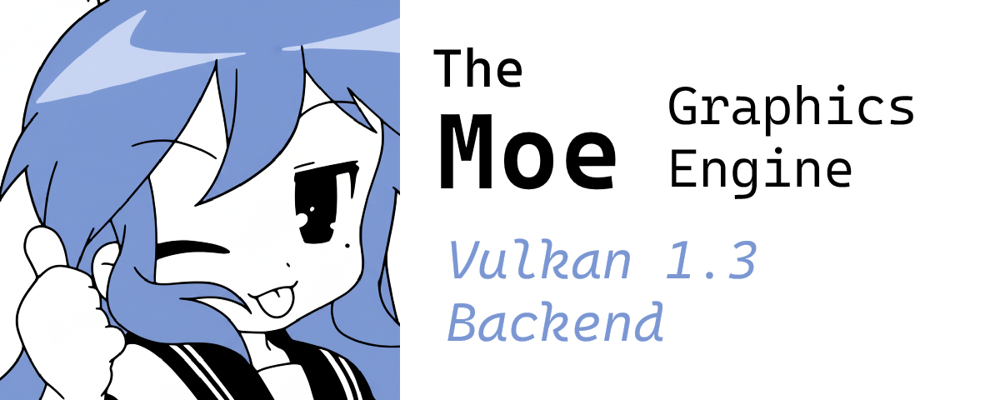

# NWPU GameDev 2025 Autumn

    <b style="font-size: 24px">With Moe Graphics Engine</b>
     
    

## Basic Info

西北工业大学 软件学院

软件开发基础能力训练 - 游戏开发方向

## Architecture

基于 Vulkan 1.3 开发的图形库，支持 2D、3D 渲染。使用 Slang 作为着色器编程语言。

基于 JoltPhysics 的物理系统。

基于 ENet 和 FlatBuffers 的网络通信。

基于 OpenAL 的音频。

## Dev Team

- 冯于洋
- 李佳睿
- 李梓萌
- 滕艺斐
- 吴焕石
